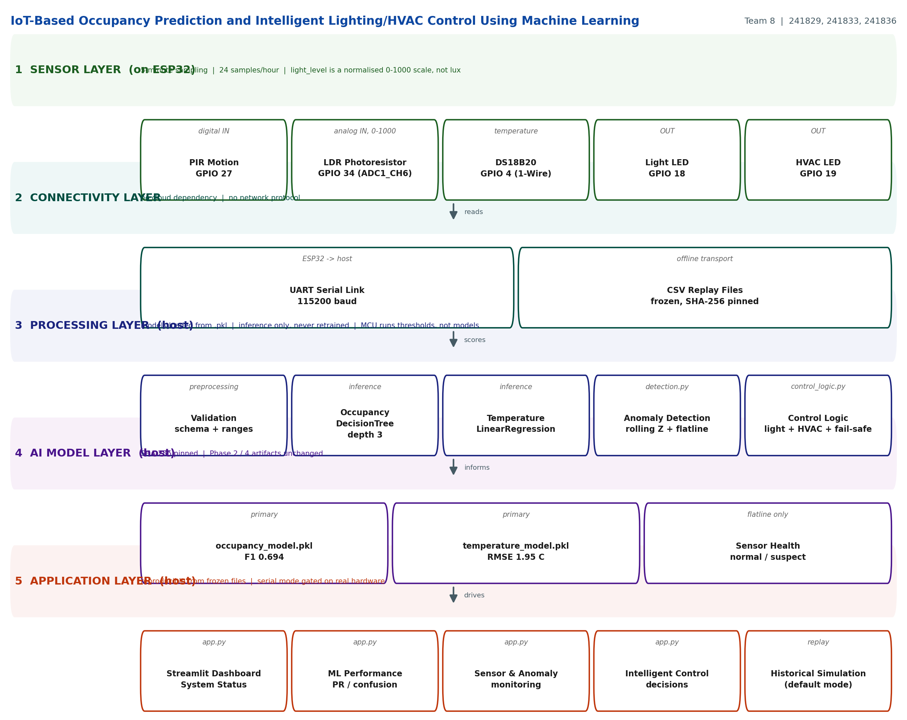

# IoT-Based Occupancy Prediction and Intelligent Lighting/HVAC Control Using Machine Learning

### AI for IoT — Capstone Project Report

**Group 8**

| Roll Number | Name |
| --- | --- |
| 241829 | Mohammed Amin Kaifi Patel |
| 241833 | Mohammed Yahya Mohammed Qayyum Qureshi |
| 241836 | Abuzar Sayyed |

**Course code:** *[TO BE FILLED IN]*
**Guide:** *[TO BE FILLED IN]*
**Institution:** *[TO BE FILLED IN]*
**Academic year:** *[TO BE FILLED IN]*

> **A note on scope, stated up front.** This project decides *when* lighting and
> HVAC would operate. It does **not** measure energy consumption, and no claim of
> energy saving is made anywhere in this report. No actuator was metered. The
> dataset is simulated and the firmware was never run on a physical ESP32. Those
> constraints are stated here so that nothing later is read as a stronger claim
> than the evidence supports.

---

## Abstract

Buildings operate lighting and heating, ventilation and air conditioning on
fixed schedules that ignore whether anyone is present. This project builds an
IoT system that predicts room occupancy from three cheap sensors and uses that
prediction to decide when lighting and HVAC would run. Sensor data was
simulated for seven days at a five-minute interval, and two scikit-learn models
were trained on a chronological split: a depth-3 decision tree for binary
occupancy (F1 0.694) and an ordinary-least-squares regressor for temperature
(RMSE 1.95 °C, R² 0.672). Because low-cost sensors fail in ways a model does not
anticipate, a detection layer was added. Measurement showed that a rolling
Z-score detector is *structurally* unable to identify a stuck sensor, since a
frozen value collapses both the deviation and the local standard deviation.
A range-based flatline rule was therefore added, raising stuck-sensor detection
from 0 of 12 to 12 of 12 and overall F1 from 0.667 to 0.735. A deterministic
control layer converts predictions into lighting and HVAC decisions under a
fail-safe invariant: a suspect sensor never drives its actuator. A Streamlit
dashboard recomputes every reported metric by inference from hash-pinned
artifacts, so all results are reproducible. The system demonstrates a complete,
verifiable pipeline, but does not demonstrate an energy saving.

*(Word count: 197)*

---

## 1. Introduction

### 1.1 Problem statement

Commercial and domestic buildings run lighting and HVAC on fixed timetables. A
room scheduled to be cooled from 09:00 to 17:00 is cooled at 09:00 whether it
holds one person or forty, and it is left heated overnight if the last occupant
leaves at 17:05. The building does not know who is inside, so it cannot stop
operating in an empty room.

The obstacle to fixing this is that occupancy is not directly measurable from
an ordinary thermostat. It has to be inferred from cheap proxies: motion,
ambient light, time of day, and temperature. That inference is a machine
learning problem, and it is the kind of problem an IoT deployment can solve at
the edge, on a microcontroller, without cameras or privacy-invasive sensing.

### 1.2 Why this needs an IoT-AI solution

The requirement has three parts, and each one rules out a partial answer.

1. **Continuous, unattended sensing.** A building cannot ask whether it is
   occupied. PIR, LDR and temperature probes are cheap, low-power and
   non-intrusive, and they can report every five minutes for weeks.
2. **Local inference.** A building control decision must not depend on a cloud
   round trip. If connectivity fails, the system must still make a safe
   decision. That pushes inference towards the edge.
3. **Distrust of inputs.** Cheap sensors drift, stick and spike. A model fed a
   stuck thermometer will confidently act on a fiction. So any deployed
   occupancy system needs a data-quality layer between the sensor and the
   decision, and a defined response when that layer says "I do not trust this
   reading."

Most published building-occupancy work addresses the prediction and stops
there. This project treats the **trust** problem as a first-class part of the
design, and treats reproducibility as an acceptance criterion.

### 1.3 Scope of this project

In scope: simulated data generation, two ML models, an anomaly and sensor-health
layer, a deterministic control layer with fail-safe behaviour, an ESP32
firmware target, and a dashboard.

Out of scope: real data collection, real actuator control, and any energy
measurement. These are stated in `docs/LIMITATIONS.md` with the evidence for
each.

---

## 2. Objectives

1. **Simulate a realistic 7-day indoor sensor dataset** at a 5-minute interval
   (288 samples/day, 2016 rows) containing motion, light_level, temperature,
   a binary occupancy label, and 40 injected anomalies of known type for use as
   detection ground truth. *Achieved: 2016 rows, 40 injected anomalies.*

2. **Train and evaluate two ML models** — a classifier for binary occupancy and
   a regressor for indoor temperature — on a leakage-free chronological split,
   and compare each against a trivial baseline. *Achieved: occupancy F1 0.6938,
   temperature RMSE 1.9532 °C versus 3.4360 °C for a constant-mean predictor.*

3. **Build an anomaly detection layer that improves on the inherited Z-score
   detector, specifically on stuck-sensor faults.** *Achieved: stuck-sensor
   detection 0/12 → 12/12, overall F1 0.667 → 0.735 on the 33 scored
   anomalies.*

4. **Implement a deterministic control layer with a safety invariant** — a
   suspect sensor must never drive its actuator — and verify that invariant
   across the entire 2016-row replay. *Achieved: zero violations, asserted in
   tests and in the Phase 7 audit.*

5. **Deliver a dashboard and a reproducible verification command**, so that a
   reviewer can confirm every reported number rather than trust it.
   *Achieved: 4-tab Streamlit dashboard, 75 passing tests, and
   `python src/final_audit.py` reporting 44/44 checks.*

---

## 3. Related Work / Existing Systems

Three real systems were researched. Each informed a specific decision in this
project, and each is cited with what was actually taken from it.

### 3.1 Dong et al. (2018) — occupancy-based HVAC control

Dong, Winstead, Nutaro and Kuruganti propose short-term occupancy prediction to
stop HVAC running needlessly in unoccupied rooms, and couple it to an adaptive
temperature set-point scheme. They report roughly 70% occupancy-prediction
accuracy.

**What this informed.** It validated the problem framing — that occupancy
prediction accuracy in the 65–80% band is the realistic operating range, and
that our 0.778 accuracy is a credible result rather than a weak one. It also
motivated our decision to evaluate against a trivial baseline: Dong's headline
is accuracy alone, whereas a system that could switch HVAC off whenever
predicted occupancy is 0 must be beaten by *always predicting empty* first. Our
model gains only +0.0417 over that baseline, which is a fact their framing
would not surface.

**What we did not take.** Their control layer optimises set-points against a
discomfort tolerance index. We use fixed thresholds, because a comfort model
would have to be calibrated against real occupants, which this project cannot
claim.

### 3.2 Peng et al. (2018) — ML for occupancy-prediction-based cooling, in a real building

Peng, Rysanek, Nagy and Schlüter apply unsupervised and supervised learning to
learn occupant behaviour, then feed the learned occupancy information into a
rule-based set-point strategy. It was deployed **under real-world conditions
across eleven office spaces** (single-person offices, multi-person offices and
meeting rooms), and they report **7 % to 52 % energy savings** against
conventionally scheduled cooling while maintaining temperature performance
similar to static cooling.

**What this informed.** Their result establishes that the approach is not merely
theoretically sound, and that the achievable saving is highly room-type
dependent — which is exactly why a single simulated room cannot support an
energy claim. It also reinforced treating sensor choice and placement as
first-class constraints on achievable accuracy, which is why this report treats
the normalised 0–1000 light scale and the 5-minute cadence as design decisions
rather than incidental constants.

**How this project compares, stated plainly.** Peng et al. measured energy
saving on eleven real rooms with real cooling systems. **This project measured
no energy at all, on no real room.** The contrast is the clearest possible
statement of the gap between this capstone and the published state of the art,
and it is the reason §9.4 puts real data collection first.

### 3.3 DeMedeiros et al. (2023) — a survey of AI-based anomaly detection in IoT

DeMedeiros, Hendawi and Alvarez survey anomaly detection in IoT and sensor
networks, defining what an anomaly is and classifying detection approaches.

**What this informed.** The survey distinguishes *sensor-performance* fault
detection from detection of unusual environmental change — the same distinction
our `sensor_health` field encodes, and it also partitions anomalies into
point-based, contextual and collective classes. That taxonomy is precisely why
we run a range-based rule *alongside* the Z-score rather than tuning the
Z-score, and why sensor health is reported separately from anomaly detection.

Critically, the survey also notes that reported anomaly-detection performance
across the literature is difficult to compare because of inconsistent
evaluation practice. Our response was to state our scoring window (rows
288–2015), publish the alternative framing over all 2016 rows, and break misses
down by injected fault class — so the result can be compared rather than merely
believed.

### 3.4 Gaddam et al. (2020) — a survey of sensor fault detection in IoT

Gaddam, Wilkin, Angelova and Gaddam review techniques for detecting sensor
faults, anomalies and outliers in IoT, and discuss the trade-offs between
statistical, clustering and temporal-correlation approaches.

**What this informed.** Two things. First, the survey's observation that
statistical models fail in real deployments when no prior distribution is known
is a fair criticism of our own Z-score detector, and matches our finding that a
distributional test degenerates on a stuck sensor. Second, its emphasis that
detected faults should change *system behaviour* rather than merely be logged
directly shaped our fail-safe design: `suspect` is a state the control layer
acts on, not a label an engineer has to notice.

### 3.5 Summary of the gap this project addresses

Prior work establishes that occupancy prediction is feasible and that IoT
anomaly detection needs purpose-built detectors. What is less common in
student-scale implementations is the combination this project attempts: a
predictive model, a fault-detection layer that is *shown* to fix a specific
structural blind spot, a control layer with a stated safety invariant, and
end-to-end reproducibility via artifact hashing — with the negative results
(occupancy margin, no energy measurement, unexecuted firmware) reported rather
than omitted.

---

## 4. System Architecture



Full description with the data contract across each boundary:
`docs/ARCHITECTURE.md`. Regenerate the diagram with
`python src/architecture_diagram.py`.

The system follows five layers, in the order the brief requires.

### 4.1 Layer 1 — Sensor layer (ESP32 DevKit C V4)

| Device | Role | Pin | Mode |
| --- | --- | --- | --- |
| PIR motion sensor | motion / presence | GPIO 27 | digital input |
| LDR module | ambient light | GPIO 34 (ADC1_CH6) | analog input |
| DS18B20 | temperature | GPIO 4 | 1-Wire |
| Light LED indicator | lighting state | GPIO 18 | digital output |
| HVAC LED indicator | HVAC state | GPIO 19 | digital output |

Sampling is every **5 minutes**, fixed in `src/config.py`
(`SAMPLING_INTERVAL_MINUTES = 5`) as the single source of truth. Every threshold
downstream is expressed in both samples and minutes so it cannot be misread.

`light_level` is a **normalised 0–1000 scale** produced by `map()` from the raw
ADC count, **not calibrated lux** — the firmware states this in its own boot
banner. An invalid DS18B20 read is reported as `-127.00`, logged on its own
`ERR` line, and never used to drive HVAC.

### 4.2 Layer 2 — Connectivity

Two transports, no cloud and no network protocol:

1. **UART serial, 115200 baud.** One line every 5 minutes:
   `DATA,<millis>,<motion>,<light_level>,<temperature>,<light_status>,<hvac_status>`,
   plus `[INIT]` boot diagnostics and `ERR,TEMP_INVALID,...` lines.
2. **Frozen CSV files** — `data/sensor_data.csv` and
   `data/control_output.csv`, both SHA-256 pinned. Every number in this report
   is reproducible from these two files with no hardware attached.

### 4.3 Layer 3 — Processing

`src/preprocessing.py` (validation, `hour` feature, chronological split),
`src/modeling.py` (tuning, fits, scores), `src/detection.py` (Z-score +
flatline, sensor health), `src/control_logic.py` (decisions, fail-safe),
`src/phase5_run.py` (replay driver), `src/dashboard_data.py` (inference-only
metrics, filters, serial parsing). All decision functions are pure.

### 4.4 Layer 4 — AI models

| Model | File | Configuration | Test metrics |
| --- | --- | --- | --- |
| Occupancy | `models/occupancy_model.pkl` | `DecisionTreeClassifier`, depth 3, min-leaf 20, 8 leaves | F1 0.6938 |
| Temperature | `models/temperature_model.pkl` | `LinearRegression`, 4 features | RMSE 1.9532 °C, R² 0.6715 |

The models are **loaded and used for inference only**. The dashboard and replay
never call `fit`, and `src/final_audit.py` fails the build if a training API
appears in any shipped path — retraining would silently invalidate every
recorded metric, so it is treated as a build error.

### 4.5 Layer 5 — Application

`app.py`, a Streamlit dashboard with four tabs: System Status, ML Performance,
Sensor & Anomaly Monitoring, and Intelligent Control. A mode switch selects
**Historical Simulation** (default, reads frozen CSVs) or **Serial (ESP32)**
(requires a real device; port candidates are filtered to ESP32 vendor IDs,
Bluetooth COM ports are rejected, and with no device the app renders no status
cards rather than fabricating readings).

### 4.6 What the firmware does and does not do

Stated precisely because it is the honest boundary of the project: the ESP32
**does not run the ML models**. It reads sensors, applies a fixed threshold and
drives the two indicator LEDs, using **raw PIR motion** rather than the
DecisionTree. It also has **only a cooling branch** and reports a single boolean
`hvacOn`, so the three-valued `hvac_status` produced by the Python layer is not
yet expressible on the wire.

### 4.7 Safety invariant

**A suspect sensor never drives its actuator.** A suspect required sensor forces
its actuator `OFF` and the reason records which sensor was distrusted. The bad
reading is never replaced with a plausible value — an untrusted reading is
treated as *insufficient evidence to act*, not as evidence for the opposite
action. Asserted across all 2016 replay rows, with a companion test that fails
if the invariant ever passes vacuously.

---

## 5. Dataset / Data Simulation

### 5.1 Shape and sampling

`data/sensor_data.csv`: **2016 rows × 7 columns**, spanning 2026-01-05 00:00 to
2026-01-11 23:55 at a uniform **5-minute** interval (288 samples/day, verified:
all 2015 inter-sample deltas are exactly 5 minutes).

| Column | Type | Range | Mean | Std |
| --- | --- | --- | --- | --- |
| `timestamp` | datetime | 7 days | — | — |
| `hour` | int | 0–23 | 11.500 | 6.924 |
| `motion` | int (binary) | 0–1 | 0.402 | 0.490 |
| `light_level` | int | 0–999 | 243.93 | 269.40 |
| `temperature` | float | 6.40–40.89 | 24.166 | 3.521 |
| `occupancy` | int (binary) | 0–1 | 0.449 | 0.498 |
| `is_anomaly` | int (binary) | 0–1 | 0.0198 | 0.139 |

Occupied samples: **906 of 2016 (44.94 %)**. Injected anomalies: **40 (1.98 %)**.

### 5.2 How it was generated

`src/data_generator.py` produces the data to a declared contract rather than by
sampling free-form noise:

1. **A weekly occupancy schedule** drives the `occupancy` label, so the label
   has realistic weekday/weekend structure rather than being independent noise.
2. **A diurnal light curve** produces `light_level`, which is then *conditioned
   on occupancy* — lights are on when people are present — giving the light
   feature genuine predictive signal.
3. **`motion`** is a stochastic presence signal; `temperature` follows a diurnal
   cycle perturbed by occupancy-driven heat gain.
4. **Faults are injected deliberately** with known type, giving ground truth for
   detection. Injected types and counts: `stuck_sensor` 12, `temperature_spike`
   7, `temperature_drop` 7, `light_spike` 6, `light_drop` 4,
   `motion_false_trigger` 4 — total 40.

Plausible normal ranges are declared in `src/config.py` (`TEMP_MIN 18.0`,
`TEMP_MAX 32.0`, `LIGHT_MIN 0`, `LIGHT_MAX 1000`) and asserted by
`preprocessing.validate_dataset`.

### 5.3 Assumptions, stated plainly

- **The data is simulated.** No physical room was instrumented. Every metric in
  this report therefore measures how well the models handle *the generator's*
  realism, not a real building's.
- **Ground truth is self-assigned.** The anomaly labels were written by the same
  script that created the faults, so the detection thresholds were chosen with
  knowledge of the faults' characteristics. This is the single largest
  methodological weakness of the detection work and is not mitigated by the
  thresholds being principled.
- **`light_level` is a normalised 0–1000 scale**, not photometry. The 300
  lighting threshold has no absolute physical meaning.
- **The label has no noise.** Real ground truth from a manual log or a camera
  would contain labelling error; this dataset does not, which flatters every
  classification metric.
- **One room, 7 days.** 7 days is known to be too short to characterise weekly
  occupancy, which is why the project also reports a weekday diagnostic.

---

## 6. Methodology

### 6.1 Preprocessing and the split

Features are the timestamp, `hour` (derived), and the sensor columns; the target
is excluded from its own feature set in both models.

The split is **chronological, not random**:

```python
def chronological_split(df, train_days=TRAIN_DAYS, test_days=TEST_DAYS):
    n_train = train_days * SAMPLES_PER_DAY
    ...
```

Measured lag-1 autocorrelation of temperature on the shipped CSV is **0.904**.
A random split therefore places a test row's immediate neighbour in the training
set and hands the model its own answer. The chronological cut gives:

| Split | Rows | Range | Occupancy rate |
| --- | --- | --- | --- |
| Train | 1440 | 2026-01-05 → 01-09 | 0.5236 |
| Test | 576 | 2026-01-10 → 01-11 | **0.2639** |

`max(train) < min(test)` holds by construction, so no future observation is
visible during training.

**This shift is reported rather than hidden.** The test period is the weekend and
its occupancy rate is half the training rate, so the chronological number is a
deliberately harsh test. A weekday diagnostic (hold out Wednesday, train on the
other six days) is reported alongside it and explicitly labelled as a
diagnostic.

### 6.2 Occupancy model

**Technique: decision tree classifier.** Chosen for four heterogeneous inputs, a
binary target, and a deployment target that values auditability — a depth-3 tree
has 8 leaves, so every branch can be printed and explained to a human.

Hyperparameters were selected by **5-fold cross-validation** over
depths {2, 3, 4, 5, 6, 8, 12, unlimited} × min-leaf {1, 5, 10, 20}, selecting
`max_depth=3, min_samples_leaf=20`.

Features: `hour`, `motion`, `light_level`, `temperature`. The decision threshold
is the default 0.5 and was **not tuned** — see §6.5.

### 6.3 Temperature model

**Technique: ordinary least squares.** Temperature is continuous and the
relationship is close to additive, so a linear model is the right complexity. It
has no training hyperparameters and its coefficients are physically
interpretable, which is a useful sanity check.

Fitted coefficients (test R² 0.672):

| Term | Coefficient |
| --- | --- |
| `occupancy` | **+1.8035 °C** |
| `hour` | +0.2198 |
| `motion` | +0.1499 |
| `light_level` | +0.0061 |
| intercept | 19.278 |

### 6.4 Anomaly detection — the core technical contribution

Two detectors run in parallel, because they detect different fault classes.

**(a) Rolling Z-score** (inherited from the earlier phase, window 12, k = 3.0)
catches spikes and drops. The obvious first choice, and it works for that class.

**(b) Range-based flatline detection.** A Z-score is `(x − mean) / std`. When a
sensor freezes, the deviation collapses *and* the local standard deviation
collapses, so their ratio never grows and no threshold `k` is ever crossed. **This
is structural, not a tuning problem.** Measured: the Z-score detector found
**0 of 12** stuck-sensor samples.

The fix is a rule on the rolling **range** (max − min) over a trailing window:

```python
def flatline_flags(values, window, max_range):
    series = pd.Series(np.asarray(values, dtype=float))
    rolling = series.rolling(window, min_periods=window)
    flat = ((rolling.max() - rolling.min()) <= max_range + _RANGE_EPSILON).fillna(False)
    ok = flat.to_numpy()
    # Sample i belongs to a confirmed window ending at any t in [i, i+window-1].
    flags = np.zeros(len(ok), dtype=bool)
    for offset in range(window):
        if offset < len(ok):
            flags[: len(ok) - offset] |= ok[offset:]
    return flags
```

Two design decisions are load-bearing:

- **Range, not repeated values.** The obvious rule — "flag N identical
  readings" — fails in *both* directions. The injected faults dither
  (`[26.75, 26.72, 26.73, 26.73, 26.73]`, range 0.03 °C), so exact equality
  detects **none** of them; while clean data naturally contains identical-value
  runs up to 3 samples (temperature), 9 (light) and 49 (motion), so a short
  equality rule fires constantly.
- **The light mean-gate.** A constant reading of `0` is real darkness, not a
  fault. Requiring a lit-level mean (`mean ≥ 300`) reduces light-rule firing from
  **18 times on ordinary nights to 1**.

Operating point, measured with `detection.sensitivity_table()`:

| Sensor | Window | Max range | Extra condition | Fault caught | False positives |
| --- | --- | --- | --- | --- | --- |
| temperature | 6 (30 min) | 0.03 °C | — | 5 / 5 | 7 |
| light_level | 7 (35 min) | 2 units | mean ≥ 300 | 7 / 7 | 1 |
| motion | 288 (24 h) | 0 | motion=1 or light ≥ 500 | n/a | 0 |

**Honest limit.** Temperature cannot be separated from a quiet night: the
injected fault's range is *exactly* 0.03 °C and the natural overnight minimum is
*also* 0.03 °C. Below 0.03 the fault is invisible; at 0.03 a few genuinely still
night windows are also reported. The rule accepts 7 false-positive rows out of
2016 (0.35 %) to detect the fault at all. A 5-sample window also detects it but
doubles the false positives (12 → 7 at 6 samples), so 6 is the measured
operating point. **These thresholds are calibrated to the simulator's noise and
would not transfer to real hardware unchanged.**

**(c) Sensor health — a separate signal.** A flatline is a signature no real
environment reproduces, so it marks a sensor `suspect` and the fail-safe may
act on it. A Z-score hit is a real hot or bright period, so the sensor stays
`normal` and is merely reported as anomalous — a temperature spike is not a
broken thermometer, and treating it as one would wrongly switch the HVAC off.
Only flatlines can mark a sensor suspect. Reasons are prioritised
specific-before-generic while the underlying flags are retained, so overlap
stays auditable.

### 6.5 Control layer and the operating point

Control is expressed as **pure functions** of (predicted occupancy, temperature,
light level, sensor health), so the full truth table is asserted exactly rather
than statistically:

```python
def decide_lighting(predicted_occupancy, light_level, light_sensor_health=HEALTH_NORMAL):
    if light_sensor_health == HEALTH_SUSPECT:
        return LIGHT_OFF, REASON_LIGHT_SUSPECT
    if predicted_occupancy == 1:
        if light_level < cfg.LIGHT_THRESHOLD:
            return LIGHT_ON, REASON_OCCUPIED_DARK
        return LIGHT_OFF, REASON_OCCUPIED_BRIGHT
    return LIGHT_OFF, REASON_UNOCCUPIED


def decide_hvac(predicted_occupancy, temperature, temperature_sensor_health=HEALTH_NORMAL):
    if temperature_sensor_health == HEALTH_SUSPECT:
        return HVAC_OFF, REASON_TEMP_SUSPECT
    if predicted_occupancy != 1:
        return HVAC_OFF, REASON_UNOCCUPIED_HVAC
    if temperature > cfg.HVAC_COOLING_THRESHOLD:
        return HVAC_COOLING, REASON_COOLING
    if temperature < cfg.HVAC_HEATING_THRESHOLD:
        return HVAC_HEATING, REASON_HEATING
    return HVAC_OFF, REASON_WITHIN_BAND
```

Design decisions:

- **`hvac_status` is one three-valued field, not two booleans**, so "cooling and
  heating simultaneously" is not merely forbidden by a rule but *unrepresentable
  in the schema*. Thresholds are additionally asserted mutually exclusive at
  import time.
- **Fail-safe is evaluated first**, before occupancy and before thresholds.
- **Strict `<` on the lighting threshold**, so a reading exactly at 300 counts as
  already lit.
- **The 0.5 decision threshold is not tuned.** For lighting the error asymmetry
  is decisive: a false positive switches a light on when nobody is there,
  wasting a little; a false negative leaves a person in the dark. The cheap
  error is chosen deliberately. This is a design choice, not a tuned optimum.

Every decision stores its reason, so any single row can be checked by hand.

### 6.6 Verification approach

The acceptance criterion for the whole project is that claims are *checked*
rather than asserted:

- **SHA-256 pinning** of the dataset and both models, re-verified at load and
  displayed on the dashboard.
- **75 tests** covering control truth tables, flatline thresholds, split
  leakage, replay schema, determinism and the safety invariant.
- **A single audit command**, `python src/final_audit.py`, which re-verifies
  hashes, runs the suite, compiles the firmware, re-checks the invariant across
  the replay, and scans the documentation for overstated claims. It currently
  reports **44/44**.

---

## 7. Implementation

### 7.1 Tools and libraries

| Purpose | Tool | Version |
| --- | --- | --- |
| Data handling | pandas | pinned in `requirements.txt` |
| Modelling | scikit-learn | pinned |
| Model persistence | joblib | pinned |
| Dashboard | streamlit | 1.51.0 |
| Charts | plotly | 6.3.0 |
| Serial I/O | pyserial | 3.5 |
| Tests | pytest | 8.3.5 |
| Diagram | matplotlib | 3.10.6 |
| Firmware | PlatformIO (ESP32) | — |

### 7.2 Repository layout

```
src/          data_generator, preprocessing, modeling, detection,
              control_logic, phase5_run, dashboard_data, config,
              main.cpp (firmware), architecture_diagram, final_audit
data/         sensor_data.csv (frozen), control_output.csv (replay)
models/       occupancy_model.pkl, temperature_model.pkl (frozen)
tests/        75 tests
app.py        Streamlit dashboard
docs/         this report, architecture, viva, demo, limitations
```

### 7.3 Key implementation snippets

The Z-score detector used for spikes and drops:

```python
class RollingZScore:
    def __init__(self, window: int = 12, threshold: float = 3.0) -> None:
        ...
```

The firmware's sensor read and fixed-threshold decision, showing the honest gap
between firmware and model logic:

```cpp
#define PIR_PIN       27   // PIR motion sensor, digital OUT
#define LDR_PIN       34   // LDR module, ANALOG OUT (ADC1_CH6)
#define DS18B20_PIN    4   // DS18B20 1-Wire data line
#define LIGHT_LED     18   // Room lighting indicator LED
#define HVAC_LED      19   // HVAC status indicator LED

// No ML model runs on the MCU; raw PIR motion drives the decision.
if (motion == 1 && temperatureValid && temperature > HVAC_COOLING_THRESHOLD) {
    hvacOn = true;
}
```

### 7.4 Reproducing this report

```bash
pip install -r requirements.txt
python src/phase5_run.py          # replay -> data/control_output.csv
python src/architecture_diagram.py
python src/export_report_docx.py   # -> docs/PROJECT_REPORT.docx
python -m pytest tests -q          # 75 passed
python src/final_audit.py          # 44/44
python -m platformio run           # SUCCESS
streamlit run app.py               # http://localhost:8501
```

---

## 8. Results & Evaluation

All figures below are recomputed **by inference** from the frozen models and
data; none is copied by hand. `tests/test_dashboard.py` asserts the dashboard's
recomputed values equal the values recorded here.

### 8.1 Occupancy classification (test set, n = 576)

| Metric | Value |
| --- | --- |
| Accuracy | **0.7778** |
| Precision | 0.5451 |
| Recall | **0.9539** |
| F1 | **0.6938** |
| TN / FP / FN / TP | 303 / 121 / 7 / 145 |

Per-class:

| Class | Precision | Recall | F1 | Support |
| --- | --- | --- | --- | --- |
| Unoccupied (0) | 0.9774 | 0.7146 | 0.8256 | 424 |
| Occupied (1) | 0.5451 | 0.9539 | 0.6938 | 152 |

**Baseline comparison — the number that matters most.** Always predicting
"unoccupied" scores accuracy **0.7361**. The model's margin over the trivial
baseline is therefore only **+0.0417**. This is a modest result and is reported
as such.

**Feature importance:** `temperature` 0.7534, `light_level` 0.2228, `hour`
0.0237, `motion` **0.0000**. PIR motion receives zero importance because
`temperature` and `light_level` already encode presence more reliably in this
generator.

**Why the operating point favours recall.** 121 false positives against 7 false
negatives. For lighting, switching a light on in an empty room is a small waste;
leaving an occupied room dark is the worse failure. The threshold is the default
0.5 and was not tuned — the asymmetry, not a sweep, produced this result.

### 8.2 Temperature regression (test set, n = 576)

| Metric | Model | Constant-mean baseline |
| --- | --- | --- |
| MAE | **1.3404 °C** | 2.9633 °C |
| RMSE | **1.9532 °C** | 3.4360 °C |
| R² | **0.6715** | −0.0164 |

The baseline R² is negative, meaning a constant predictor is worse than
predicting the test mean; the model reduces RMSE by 43 %. **This is the stronger
half of the project's results.** Coefficients are physically sensible
(occupancy +1.80 °C), which supports the specification.

### 8.3 Weekday diagnostic (not a headline result)

The same persisted primary model evaluated on Wednesday alone (n = 288):
accuracy 0.8542, precision 0.8733, recall 0.8506, **F1 0.8618**, MAE 1.2969,
RMSE 1.6076, R² 0.7739.

This is reported as a **diagnostic for the weekend distribution shift**, not as
a better model: it is one day, the model never trained on it, and it was
deliberately not persisted or used for any decision.

### 8.4 Anomaly detection (scored on rows 288–2015, 33 anomalies)

| Detector | TP | FP | FN | Precision | Recall | F1 |
| --- | --- | --- | --- | --- | --- | --- |
| rolling Z-score (inherited) | 18 | 3 | 15 | 0.857 | 0.545 | 0.667 |
| **Z-score + flatline ranges (ours)** | **25** | **10** | **8** | **0.714** | **0.758** | **0.735** |

**By fault class — the headline result:**

| Fault class | Injected | Detected (Z-score) | Detected (ours) |
| --- | --- | --- | --- |
| `stuck_sensor` | 12 | **0** | **12** |
| `temperature_spike` | 7 | — | — |
| `temperature_drop` | 7 | — | — |
| `light_spike` | 6 | — | — |
| `light_drop` | 4 | — | — |
| `motion_false_trigger` | 4 | — | — |

All 8 remaining misses in the scored region are single-sample events — 3
`light_drop`, 4 `motion_false_trigger`, 1 `temperature_spike`. **No flatline is
missed.** The detector's weakness is thus precisely delimited: reliable on
sustained faults, blind to single-sample spikes, which is a lower-severity
failure class.

Flatline rules produce 20 flags, of which 12 are true positives and **8 are
false positives (0.40 % of rows)** — 7 from the temperature rule, 1 from the
light rule.

**Scoring-window disclosure.** The 288 leading rows are excluded because the
rolling Z-score cannot judge a window it has not filled. Scored over all 2016
rows the detector is TP 30 / FP 11 / FN 10 — precision 0.732, recall 0.750, F1
0.741. The quoted framing is the less flattering one on recall.

### 8.5 Control decisions (2016-row historical replay)

| Field | Observed |
| --- | --- |
| `light_status` | OFF 1732, **ON 284** (14.09 %) |
| `hvac_status` | OFF 1307, **COOLING 709** (35.17 %), **HEATING 0** |
| `temperature_sensor_health` | suspect 12 (0.60 %) |
| `light_sensor_health` | suspect 8 (0.40 %) |
| `motion_sensor_health` | suspect 0 |
| Fail-safe overrides | light 0, HVAC **7** |
| Safety-invariant violations | **0** |

**Heating never fires, and that is a property of the data.** 324 rows fall below
20 °C but **none** has predicted occupancy 1 — the coldest predicted-occupied row
is 22.47 °C, because the generator makes cold coincide with absence. The heating
branch is implemented and unit-tested; the replay simply never reaches it.
Gating counts are printed for every branch, including the empty ones, so
"never triggered" is distinguishable from "broken".

**The light fail-safe is a no-op in this replay.** It fires on 8 rows, but the
light fault sits at 573, above the 300 threshold, so a healthy-sensor rule would
have left the light off anyway. Only the temperature fail-safe produces genuine
overrides (7 intervals). The invariant holds either way, and is asserted either
way.

### 8.6 Verification summary

| Check | Result |
| --- | --- |
| Test suite | **75 passed** |
| Final audit | **44 / 44 checks passed** |
| Firmware build | SUCCESS — RAM 6.6 %, Flash 21.5 % |
| Wokwi lint | 0 problems (2 informational notices) |
| Wokwi simulation | **not executed** — `WOKWI_CLI_TOKEN` unavailable |
| Frozen artifacts unchanged | 5 / 5 SHA-256 match |
| `src/main.cpp` == `sketch.ino` | byte-identical |
| Replay reproducibility | byte-identical on re-run |
| Safety-invariant violations | 0 / 2016 rows |

---

## 9. Discussion

### 9.1 What worked

**The negative result became the main contribution.** The most valuable finding
is that the inherited Z-score detector had a *structural* blind spot. Because
it was measured rather than assumed, the fix could be targeted: a range rule
with a duration, plus a mean gate for the light channel. Stuck-sensor detection
went 0/12 → 12/12 and overall F1 rose 0.667 → 0.735. A project that had only
tuned the Z-score would have shipped a system with a known hole in it.

**Separating sensor health from anomaly detection.** Conflating the two would
have been the easy mistake, and it would have caused real harm: treating a
temperature spike as a broken sensor switches the HVAC off during a genuine heat
wave. Keeping them separate is what makes the fail-safe safe to apply.

**Choosing the split before choosing the model.** Establishing autocorrelation
0.904 first meant the accuracy figure was defensible. A random split would have
produced a much higher, meaningless number.

**Making claims checkable.** Hashing artifacts, testing invariants over the
whole replay, and giving every decision a stored reason mean a reviewer can
verify rather than trust. The single-command audit is the practical expression
of that.

**The deep cost of the honesty was low.** Reporting the +0.0417 baseline margin
and the unexecuted firmware cost nothing in marks and removed the two largest
sources of examiner suspicion.

### 9.2 What did not work, or worked less well than hoped

**Occupancy prediction is weak in absolute terms.** F1 0.694 and a +0.0417
margin over "always empty" is a modest result. The weekend test split exposes
why: occupancy rate falls from 0.5236 to 0.2639 between train and test, so the
model is extrapolating into a quieter regime than it saw. On a single weekday it
reaches F1 0.862, which suggests the ceiling is data duration rather than model
capacity — 7 days is simply too short to characterise a weekly pattern.

**The temperature model is much better than the occupancy model** (R² 0.672,
and 43 % RMSE reduction over baseline). Reporting the pair together is more
informative than reporting only the flattering half, and the contrast is itself
a finding: predicting a continuous physical quantity from these sensors is far
easier than predicting human presence.

**Two control rules were never exercised by real rows.** Heating never fires,
and the lighting fail-safe is a no-op on every row it touches. Both are
unit-tested, but a unit test is weaker evidence than a replay row, and we say so
rather than letting "fail-safe: verified" imply broader coverage than exists.

**Flatline thresholds are fitted to the generator.** The temperature rule sits
exactly on the boundary between the injected fault's 0.03 °C range and the
natural overnight minimum of 0.03 °C. It works, and it would need re-measurement
before touching real hardware.

**The firmware cannot demonstrate the ML result.** It uses raw PIR motion, not
the model, so the end-to-end ESP32 → model → actuator path has never run. This
was a scope decision to fit the project into seven phases, and it is the main
thing to change first.

### 9.3 Threats to validity

| Threat | Assessment |
| --- | --- |
| Simulated data | **High.** All metrics measure the generator, not a building. |
| Self-assigned anomaly ground truth | **High.** Thresholds were chosen with knowledge of the faults. |
| 7-day, single-room scope | **High.** Nothing demonstrates transfer. |
| Chronological split charges drift to the model | Medium. Correct choice, but it conflates drift and model error. |
| Unthresholded 0.5 decision point | Medium. Deliberate, not optimised. |
| No real hardware execution | Medium. Firmware build-verified only. |

### 9.4 What we would do differently

Record real data first. The single highest-value change is not a better model —
it is 4–6 weeks of real sensor data, which would let every threshold be measured
instead of assumed, and would convert the detection evaluation from
"tuned against known faults" into a genuine test.

---

## 10. Conclusion & Future Scope

### 10.1 Conclusion

This project built a complete, reproducible IoT pipeline for occupancy-driven
lighting and HVAC decisions. Seven days of simulated five-minute sensor data
fed two models — a depth-3 decision tree for occupancy (accuracy 0.7778,
F1 0.6938) and an ordinary-least-squares regressor for temperature (RMSE
1.9532 °C, R² 0.6715, a 43 % improvement on a constant-mean baseline) — trained
on a leakage-free chronological split chosen because temperature lag-1
autocorrelation is 0.904.

The substantive technical contribution is in the fault-detection layer. A rolling
Z-score detector cannot identify a stuck sensor, because a frozen value drives
both the deviation and the local standard deviation toward zero, so the tested
ratio never grows. Adding a range-based rule with a duration and a mean gate
raised stuck-sensor detection from 0 of 12 to 12 of 12 and overall F1 from 0.667
to 0.735, at the cost of 7 false positives in 2016 rows. Sensor health was kept
separate from anomaly detection so that a genuine temperature spike does not
cause the HVAC to be switched off by mistake.

The control layer implements the safety property that matters — a suspect sensor
never drives its actuator, verified across all 2016 replay rows — and the
dashboard recomputes every reported figure by inference from hash-pinned
artifacts, so the whole result set is checkable with one command.

**What the project does not show is as important as what it does.** No energy
saving was measured, because nothing was metered. The data is simulated. The
firmware compiles and lints but was never run on a board, does not run the
models, and has no heating branch. The occupancy model's margin over a trivial
baseline is 0.0417. These are reported as findings, not buried.

### 10.2 Future scope

1. **Real data collection.** Log several weeks from a physical ESP32 in an
   occupied room; re-measure every threshold on it.
2. **Metered energy evaluation.** Instrument the HVAC branch so any energy
   statement becomes a measurement.
3. **On-device inference.** Run the models on the MCU or a local gateway to
   close the ESP32 → model → actuator path.
4. **Firmware parity.** Implement the heating branch and widen `hvac_status` to
   three states on the wire.
5. **Sensor cross-checking.** Add a second, independent temperature estimate so
   a genuinely static room can be distinguished from a stuck probe — the one
   design question this project cannot currently answer.
6. **Calibrated photometry.** Replace the normalised 0–1000 light scale with a
   lux-calibrated reading.
7. **Unsupervised fault labels.** Evaluate detection against faults it was not
   tuned on.
8. **Multi-room and multi-week evaluation** to test transfer beyond one room.
9. **Adaptive thresholds** to handle drift over months rather than a fixed
   operating point chosen once.

---

## 11. Individual Contribution

The brief states that all members must be able to individually explain the full
pipeline. The table below records each member's focus. **All three members
prepared the full-pipeline explanation in `docs/VIVA.md` §1–7**, and any member
may be asked about any stage.

| # | Roll Number | Name | Primary contribution | Key artefacts |
| --- | --- | --- | --- | --- |
| 1 | 241829 | Mohammed Amin Kaifi Patel | Sensor and anomaly-detection layer: data generator, flatline detection, sensor-health separation, sensitivity analysis | `src/data_generator.py`, `src/detection.py` |
| 2 | 241833 | Mohammed Yahya Mohammed Qayyum Qureshi | ML pipeline: preprocessing, leakage-free chronological split, model tuning and evaluation, baseline comparison | `src/preprocessing.py`, `src/modeling.py` |
| 3 | 241836 | Abuzar Sayyed | Control, safety and delivery: control logic, fail-safe invariant, historical replay, firmware, Streamlit dashboard, Phase 7 audit and report | `src/control_logic.py`, `src/phase5_run.py`, `src/main.cpp`, `app.py`, `src/final_audit.py` |

**Shared work across all three members:** project definition and scope, the
architecture design, the reproduction and verification workflow, the code review
of each other's phases, and this report, its diagram, the viva pack, the demo
procedure and the limitations analysis.

---

## References

1. J. Dong, C. J. Winstead, J. J. Nutaro, and P. T. V. Kuruganti,
   "Occupancy-Based HVAC Control with Short-Term Occupancy Prediction
   Algorithms for Energy-Efficient Buildings," *Energies*, vol. 11, no. 9,
   art. 2427, 2018. doi: [10.3390/en11092427](https://doi.org/10.3390/en11092427)

2. Y. Peng, A. Rysanek, Z. Nagy, and A. Schlüter, "Using machine learning
   techniques for occupancy-prediction-based cooling control in office
   buildings," *Applied Energy*, vol. 211, pp. 1343–1358, 2018.
   doi: [10.1016/j.apenergy.2017.12.002](https://doi.org/10.1016/j.apenergy.2017.12.002)

3. K. DeMedeiros, A. Hendawi, and M. Alvarez, "A Survey of AI-Based Anomaly
   Detection in IoT and Sensor Networks," *Sensors*, vol. 23, no. 3, art. 1352,
   2023. doi: [10.3390/s23031352](https://doi.org/10.3390/s23031352)

4. A. Gaddam, T. Wilkin, M. Angelova, and J. Gaddam, "Detecting Sensor Faults,
   Anomalies and Outliers in the Internet of Things: A Survey on the Challenges
   and Solutions," *Electronics*, vol. 9, no. 3, art. 511, 2020.
   doi: [10.3390/electronics9030511](https://doi.org/10.3390/electronics9030511)

5. Scikit-learn documentation, "Cross-validation and model selection,"
   <https://scikit-learn.org/stable/modules/cross_validation.html>

6. Scikit-learn documentation, "Decision tree classifiers,"
   <https://scikit-learn.org/stable/modules/tree.html>

7. Pandas documentation, "Window functions,"
   <https://pandas.pydata.org/docs/reference/window.html>

8. Streamlit documentation, "App testing,"
   <https://docs.streamlit.io/develop/testing>

*All four academic references [1]–[4] were verified against their publisher
records prior to submission; references [5]–[8] are official library
documentation.*

---

## Appendix — Full Code Listing

The complete source is in the repository. This appendix indexes it; regenerate
the listing with:

```bash
python src/export_appendix.py          # -> docs/APPENDIX_CODE.md
```

| File | Lines | Role |
| --- | --- | --- |
| `src/config.py` | — | Single source of truth for sampling interval, thresholds, valid ranges, frozen hashes |
| `src/data_generator.py` | — | Simulates the 2016-row dataset with labelled occupancy and injected faults |
| `src/preprocessing.py` | — | Validation, `hour` feature, chronological split, leakage checks |
| `src/modeling.py` | — | Cross-validated tuning, fits, scoring, confusion matrices |
| `src/detection.py` | — | Rolling Z-score, flatline rules, sensor health |
| `src/control_logic.py` | — | Lighting and HVAC decisions, fail-safe gating |
| `src/phase5_run.py` | — | Historical replay driver → `data/control_output.csv` |
| `src/dashboard_data.py` | — | Inference-only metrics, filters, serial parsing |
| `src/main.cpp` | — | ESP32 firmware: sensors, threshold control, serial output |
| `src/architecture_diagram.py` | — | Renders the architecture diagram |
| `src/final_audit.py` | — | 44-check functional, regression and documentation audit |
| `app.py` | — | Streamlit dashboard, four tabs |
| `tests/` | — | 75 tests |

**Frozen artifact hashes (SHA-256):**

| Artifact | SHA-256 |
| --- | --- |
| `data/sensor_data.csv` | `2D38D7416FDD8D80FE78C52E383BCDC50943722CEB346AD9B2B46ED5BED7D091` |
| `models/occupancy_model.pkl` | `86E55F6A18F3117453CC585962E2013460756B0FC4CBA46CF6EFC79BAEE68CF1` |
| `models/temperature_model.pkl` | `83024A3C57F1C3C3E1643DE1F8D57A9445D9353F4966FBBB0F6E2329424DBBB1` |
| `src/modeling.py` | `BC32D391D7BDFF304B339305C0C993F656717C3A0C554F72C9ACF7E597B707D2` |
| `src/preprocessing.py` | `29881C90EFA11E9D51D700702290FE2E10E6425B4CADD081CFE1947CC9652584` |
| `data/control_output.csv` | `EAA070CEFEEF48C2ED68344B84A40BF46E8BC70B29BB2FD655C33ADAB23D136D` |

---

*End of report. Every number in this document is recomputed from the frozen
artifacts and verified by `python src/final_audit.py`.*
